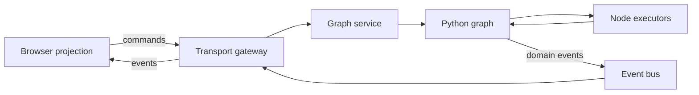

# Target Architecture

## Goal

Func Pipes runs an independent node executor graph in Python. The browser lets
a user create and edit that graph, then renders the graph and its live values.
Frontend nodes are deliberately dumb projections: they do not execute domain
node functions or decide authoritative graph state.



## Ownership boundaries

### Python owns

- Graph and node instance identity.
- Node-type definitions and pip schemas.
- Pips, edges, and graph validation.
- Node configuration and runtime values.
- Execution order and the event queue.
- Errors and execution status.
- Graph revision and event sequence numbers.
- Snapshots and persistence-ready serialization.

### Browser owns

- Canvas viewport, pan, and zoom.
- Selection and hover state.
- Temporary drag and connection gestures.
- Optimistic presentation only when it can be reconciled safely.
- Rendering Python node schemas and values.

Node position may initially live in the browser. If layouts must survive across
clients or reloads, position becomes graph metadata owned by Python.

### Transport gateway owns

- WebSocket connection lifecycle.
- Authentication and graph authorization when added.
- Parsing and serializing protocol envelopes.
- Routing commands to the selected graph.
- Subscribing clients to graph events.
- Returning command acceptance or rejection.

The gateway does not implement graph rules.

## Runtime components

### Graph manager

The application-level registry for active graph sessions. It creates, finds,
and disposes graphs by `graph_id`. A graph must continue to run independently
of whether a browser is connected.

### Graph service

The command boundary around a graph. It validates command shape, resolves the
target graph, invokes graph operations, and produces accepted/rejected command
outcomes.

### Graph

The authoritative aggregate containing nodes, pips, edges, queue state, and
revision. Graph mutations happen through explicit methods, not by exposing its
dictionaries to transport code.

### Node registry

A catalog of allowed Python node types and their serializable descriptions.
Creating a node instance references a registered type rather than accepting
arbitrary code from a client.

### Event bus

Receives graph domain events. Internal routing, logging, persistence, and the
WebSocket gateway can subscribe independently. Nodes and graphs must not call a
WebSocket object directly.

## Node description

Each Python node type needs metadata suitable for creating a generic frontend
panel:

```json
{
  "type": "multiply",
  "label": "Multiply",
  "inputs": [
    {"name": "value", "value_type": "number", "required": true},
    {"name": "multiplier", "value_type": "number", "default": 2}
  ],
  "outputs": [
    {"name": "result", "value_type": "number"}
  ],
  "view": {"component": "generic-value"}
}
```

The first implementation should use a generic Vue node renderer. Specialized
components may be selected through trusted view hints, but node execution stays
in Python.

## Graph lifecycle

```text
Client connects
-> client creates a graph or attaches to an existing graph_id
-> server subscribes the connection to that graph
-> server sends a complete snapshot
-> client builds its projection
-> client sends commands
-> server applies commands and broadcasts resulting events
-> client applies events in sequence
-> reconnecting client requests a new snapshot or missed events
```

Graph creation is a user request, but graph lifetime must be explicit. The MVP
may keep graphs in memory until process exit. Later policies can add owner
sessions, idle expiry, persistence, and recovery.

## Execution flow

```text
UI sends node.execute or node.input.set
-> graph validates the target node and pip
-> graph queues execution
-> node emits an output into the graph
-> graph records node.output_emitted
-> graph routes the value to connected Python pips
-> downstream work is queued
-> the event bus publishes observable events
-> subscribed UIs update displayed state
```

A node output has two effects:

1. It is internal graph data used to drive downstream Python nodes.
2. It is an observable domain event used to update clients and diagnostics.

Internal execution must continue when no UI is connected.

## Design invariants

1. Python is authoritative; a UI event never silently becomes graph truth.
2. Commands request actions; events state completed facts.
3. Every mutable graph resource has a stable ID.
4. Every accepted mutation advances the graph revision.
5. Observable events have a monotonically increasing sequence within a graph.
6. The graph does not import Flask or a WebSocket implementation.
7. Transport payloads use JSON-safe values or an explicit codec.
8. Invalid commands produce structured rejection messages and no partial
   mutation.
9. Pip removal or rename handles connected edges atomically.
10. A snapshot is sufficient to construct a complete UI projection.
