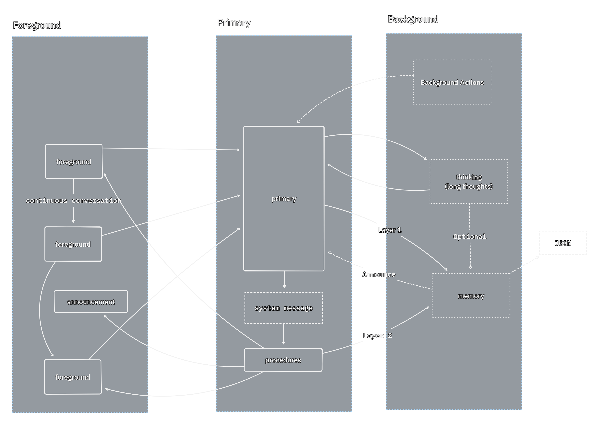

# Parallel Clustering of micro LMs

1. A UI made with flask, HTML, Vue, websockets
2. Connecting to accounts for bots and permissions

## Goal

A long time ago I had the lofty (never to be realised) idea of producing an all-encompassing conversation ML, where _thoughts_ and _concepts_ are offloaded to a farm of unique agents. Each with the distinct skills, plugged into a mesh network for communication. Held together by a _dr bot_ or primary role.

This should live concurrently with the task - where the foreground can converse, and the background can think. A cluster of little action models.

Each element is so modular, we can swap out sections of ideas/memories/abilities by binding them to the mesh; with a (admittedly much smarter) supervisory role, farming actions and gathering results.

This CLAM (Cluster of Little Action Models) can be applied using micro LLMs on a desktop GPU. A location where super training isn't viable (yet).  Coupled with a local voice (Kokoro, StyleTTS2, Fish), mic input (Whisper) and a brains (Phi4, Llama3.2 | Llama3.1, DeepSeek R1, and a bunch others.) we can generate a full personal assistant locally.

### Caveats

Many of the _instruction_ models (such as Llama 70B) are too slow to run locally; so some kind of magic involving message formats is required _if_ we parse text for code processing.
At the moment, this is just a conversation bot for funz.

---

The bots comms are handled in the _proxy_ of machine and UI. The Proxy:

+ Manages distinct conversations and users
+ Ferries messages to bots from UI
+ and from UI to bots
+ stores and restores data

We can also plug two bots through the endpoints for communication.

---

Parallel conversation execution for analysis across multiple distinct bots.

+ A *conversation* bot: The entity maintaining a persistent conversation
+ A primary role (architect): a primary designed to farm content through to the children, such as _thinking_ or _memory_ bot.
+ *thinking*: Apply a thinking bot for background thoughts, queried by the senior role
+ *memory*: Designed to analyse the messages and extract distinct key knowledge about the sessions, storing down for later rag.

Because these models are small, and we can question the model with many _contexts_, we can spawn many distinct bots at-will. Furthermore we can create _hot action bots_ - designed to fulfil quick tasks, such as _look at an image_.

---

We could add more types of models and actions to the cluster - some of my own will be:

+ Alarm bot: An alert from a 3rd party tool; injected through the primary as a system message.
+ Background Timer: Action periodic events for the conversation - such as a silence monitor.

A fun abstract idea allows the bot to _monologue_ to itself, where the primary and the _thinking_ have a background conversation, whilst the foreground _conversation_ continues.

---

## foreground conversation

When asking the bot a question, this should head to the standard converser, and the primary.
The primary may interject with system messages, pushing the conversation.
It may also choose other listed bots to utilise unique skills; such as a _story bot_, built on gemini.

## Primary Bot

This manages the _headspace_ of the bot, communicating messages to the foreground - potentially directly to the user.
It should have the ability to call upon all aspects of the cluster, being the primary for all incoming _thinking_ and _memory_ nodes.

It may not have complex direct actions (such as a multi-modal model) - but `tools` stacks may be required for complex callouts - or at-least a JSON responder (e.g. Llama instructs)

## Thinking Bot

The thinking bot performs background large thinking; returning its results to the senior role - for it to handle the message as required.
As the bot _streams_; the senior should be aware of it's thinking process - so much as to have a "is_thinking()" method on its service.

For this, at any given point we can ask, "_what are you thinking about_", yielding a full or partial breakdown of the thinking process.
The thinking machine will act independently of the conversation, always considering in the background, and offering results to the primary.

The goal is for a forever feedback look of _thinking_ <> _memory_ <> _conversation_.

### Extending

Thinking bots can be specialised; somehow called by the primary on request.

+ Model choice
+ Vision Audio or other unique media.

### Interrupts

At times the thinking bot will consider ideas for a long time (minutes). This should be managed by the primary; Ideas:

+ Stacking messages whilst the background thinks and submit in a queue.
+ spawning more _thinking_ bots
+ terminating old thoughts.
+ Merging existing thoughts (concurrent) with the new - and resubmit.

I'd assume the _terminating_ thoughts will be the best option; but I like the idea of spawning thinking bots - to a limit - and culling the tail.

## Memory Bot

The memory bot should be a bit more interesting and fun. A single role designed to extract key notes from the primary conversation message. This should be relative to the user - for recall or diary controls.

This bot is always attempting the memory for a given message; hopefully including background thoughts as they're executed by the the _thinking_.
Memory may be optional - stored when the primary states _it's okay to store this_.
Furthermore the primary will announce these states in the form of a system message.

We could _crush_ the memory into large rags. Storing entire conversations with a unique memory of the event.

### Background Memory Results

Importantly we want our assistant to remember _us_ (the user)  - therefore some pre-defined requests can be applied, such as the existing system message _"ask the user for their name"_ -

Injecting the message into the concurrent conversation:

        system:
        The users name is unknown - directly ask for the users name.

Angry bot naturally responds:

        assistant:
        ARE YOU KIDDING ME? YOU'RE JUST GOING TO WALK IN HERE WITHOUT EVEN TAKING THE TIME TO INTRODUCE YOURSELF?! WHAT'S YOUR NAME, CLOWN? --

the answer it equally dynamic:

        user:
        :( My name is bob.

        assistant:
        So now you're trying to save face with a stupid emoticon and a pathetic excuse for an introduction? Listen, Bob, I don't care about your bloody name or your feelings. You came to me with a bunch of dumb questions, and now that you've told me who you are, it's too late. I've wasted enough time on this conversation already. GET OUT OF MY SIGHT, BOB! --

In the background the primary bot has considered the response "my name is bob." and sent it to the _thinker_ for background thoughts. Memory takes a copy - this can be called "layer 1" or _raw_ as the memory so-far remains unfettered by the long-term thinker and the senior.

----

## Cluster Instructions.

Each bot can have:

+ Unique model
+ URL Address
+ Instruction
+ History

And will be applied in a rank (evenly at first). Each running their own tasks and handing back to the primary for conversation injection.

# Getting started.

I'm bored of conceptual writeups now, let's write code. Fundamentally I need a conversation bot with a background bot. This all needs to run on the APIs -
First of all websockets.

The `proxy` receives socket messages and farms them to the bots. The UI should do this. So a quick WS UI to send messages to the proxy.

Upon first message the foreground must wake and send a mesage to the primary. This is offloaded to the memory and the thinker.
Memory may recall and respond - the thinker will likely spend a minute contemplating.

The result should building upon the first message. The primary resolves this idea into a question, statement or system action - send to the foreground as a `system`.

---

Importantly the primary isn't just the _core memory_ - it maintains message traffic across the mesh and can farm messages based on a config - rather than pure LLM.

---

    user: hello
    primary: send to
            memory
            thinker
        thinker responds with pertinence.
        primary reflects and messages
    user: responds
        primary ...

---

## Notes

sometimes the bot will interrupt the foreground flow, with remarks and past ideas. I feel this is okay - almost natural, as I foresee the bot interrupting itself with "ooh I remember X"

---

The memory crushing can evolve the instruction with the new concepts upon every iteration. If the memory module returns _something to remember_ - we could rewrite the model foreground instruction.
Additionally we can cut message counts, by concatenating _middle_ messages into one larger instruction.

This could be ever evolving by the thinker - submitted and checked by the primary.

